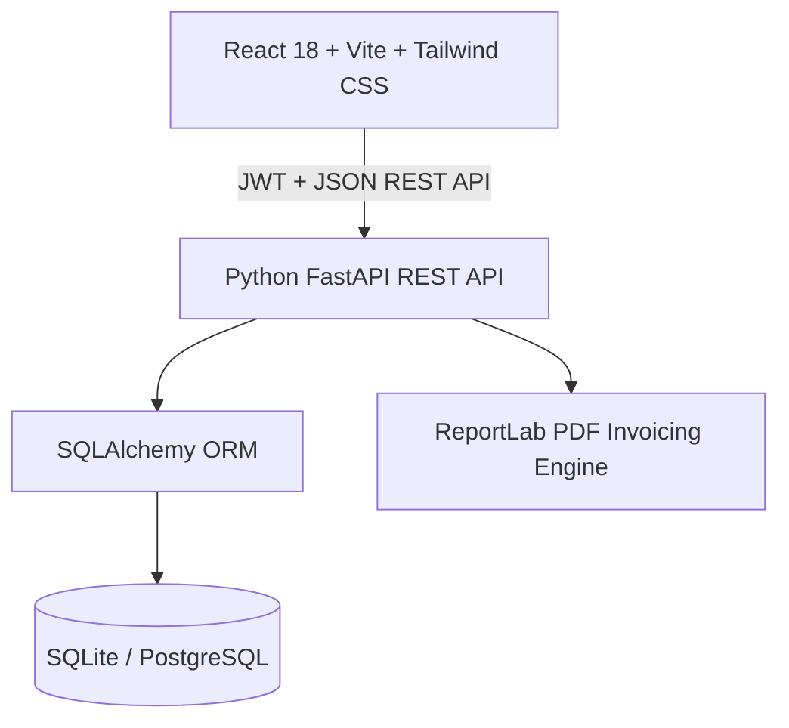

# 🌾 AgroConnect — Nagpur B2B Farm-to-Retail Marketplace

[](https://python.org)
[](https://fastapi.tiangolo.com)
[](https://www.sqlalchemy.org/)
[](https://react.dev)
[](https://tailwindcss.com)
[](LICENSE)

> A full-stack, enterprise-grade B2B Agricultural Produce Trading Platform designed specifically for the **Nagpur & Vidarbha APMC Agricultural Corridor**, connecting local farmers directly with urban supermarkets and wholesalers.

---

## 🎯 Key Features

- 🔐 **JWT Authentication & Role-Based Access Control (RBAC)**: Distinct permissions for **Farmers** (sellers), **Retailers** (buyers), and **Admins** (APMC market regulators).
- 📦 **Bulk Produce Batch Management**: Minimum Order Quantity (MOQ) validation, harvest date freshness tracking, and quality grading (Grade-A Export, Certified Organic).
- 💳 **Simulated Razorpay B2B Checkout**: Atomic inventory stock deduction, APMC regulatory cess (1.5%), freight logistics calculations, and simulated payment gateway.
- 📄 **Automated PDF Tax Invoices**: Generates professional B2B Consignment & Tax Invoices with ReportLab, downloadable with 1 click.
- 📈 **Mandi Price Intelligence**: Live APMC market price benchmarks (Nagpur Kalamna, Katol, Wardha, Amravati) with dynamic savings calculator.
- ⚡ **1-Click Interview Demo Switcher**: Instant role toggling between Farmer, Retailer, and Admin for live technical demonstrations.

---

## 🏗️ Architecture & Tech Stack



| Component | Technology | Description |
| :--- | :--- | :--- |
| **Backend** | Python 3.11+ / 3.13, FastAPI | High-performance asynchronous REST API |
| **ORM & DB** | SQLAlchemy 2.0, SQLite / PostgreSQL | Relational database modeling with foreign keys |
| **Validation** | Pydantic v2 | Request/response data validation & serialization |
| **Security** | PBKDF2-HMAC-SHA256, python-jose | Salted password hashing & JWT token handling |
| **PDF Engine** | ReportLab | Programmatic B2B Tax Invoice & Consignment generator |
| **Frontend** | React 18, Vite, Tailwind CSS, Lucide | Modern, responsive component architecture |

---

## 🚀 Quick Start Guide

### 1. Clone & Set Up Backend

```bash
cd backend
python -m pip install -r requirements.txt
python seed.py
python run.py
```
* Backend will run on: `http://127.0.0.1:8000`
* Interactive Swagger API Documentation: `http://127.0.0.1:8000/docs`

### 2. Set Up Frontend

```bash
cd ../frontend
npm install
npm run dev
```
* Frontend will run on: `http://localhost:5173`

---

## 🧪 Pre-configured Demo Accounts (for Evaluators)

| Role | Name | Email | Password | Location |
| :--- | :--- | :--- | :--- | :--- |
| **Farmer** | Ramesh Patil | `ramesh@katolfarms.com` | `password123` | Katol, Nagpur Rural |
| **Retailer** | Rajesh Gupta | `rajesh@nagpurmart.com` | `password123` | Itwari, Nagpur |
| **Admin** | APMC Officer | `admin@apmc-nagpur.gov.in` | `password123` | Kalamna Mandi, Nagpur |


